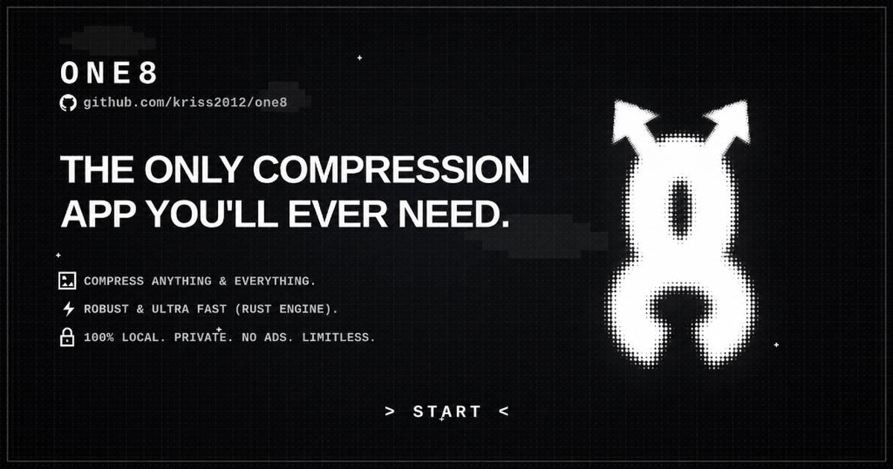

<div align="center">



# ONE8

> **THE ONLY COMPRESSION APP YOU'LL EVER NEED.**  
> *A fast, private, local-first compression application for images and media.*

[](https://github.com/kriss2012/one8)
[](LICENSE)
[](https://flutter.dev)
[](https://www.rust-lang.org)
[](#supported-platforms)

</div>

---

## ⚡ Overview

**ONE8** is a state-of-the-art, local-first image and media compression suite engineered for speed, simplicity, and total data privacy. Built with a fluid Flutter Material 3 presentation layer and powered by a multi-threaded native Rust processing engine via `flutter_rust_bridge` (v2), ONE8 executes heavy compression routines entirely on your device with zero cloud dependencies.

- 🔒 **100% Local & Private**: No cloud servers, no network requests, no analytics, no ads. Your files never leave your device.
- 🚀 **Rust-Powered Engine**: Multi-threaded, Rayon-accelerated compression core with high throughput and low memory footprint.
- 🛡️ **Zero-Crash Fallback**: Automatic native library detection with a pure Dart raster fallback (`image` package) when native binaries are not built.
- 🔍 **Visual Split-Screen Inspector**: Real-time before/after comparison slider with interactive zoom, dimension tracking, and size metrics.
- 📦 **Batch Compression**: Process individual files or entire albums in parallel across JPEG, PNG, and WebP formats.

---

## 💎 Core Principles

| Principle | Description |
|---|---|
| **LOCAL** | Everything is computed strictly on-device. No background uploads or telemetry. |
| **FAST** | SIMD and Rayon worker pool maximize your hardware's CPU cores. |
| **PRIVATE** | No tracking, no external APIs, no advertisements. Clean and limitless. |
| **FLEXIBLE** | Full control over dimensions, quality factors, formats, and batch queues. |

---

## 🏗️ System Architecture

ONE8 adheres to **Clean Architecture** patterns, guaranteeing loose coupling, testability, and a clear boundary between presentation, domain rules, data sources, and native FFI components:

```text
one8/
├── lib/
│   ├── app/                                 Application bootstrap & dependency injection root
│   ├── core/                                Design tokens, theme, shared widgets, logging, DB
│   └── features/
│       ├── history/                         Local history logging (ObjectBox)
│       ├── navigation/                      Adaptive navigation and responsive shells
│       └── image_compression/
│           ├── domain/                      Use cases, entities, repository contracts
│           ├── data/                        FFI Rust engine bindings, fallback worker, saver
│           └── presentation/                Comparison inspector, sliders, preset pickers
├── rust/
│   └── image_engine/                        SIMD-accelerated Rust core, Rayon thread pool
├── assets/                                  Branding, vector icons, and graphics
├── docs/                                    Documentation, diagrams, and media banners
└── tool/                                    Native build scripts for Android & Apple ABIs
```

---

## 📱 Supported Platforms

- **Android**: API 21+ (`arm64-v8a`, `armeabi-v7a`, `x86_64`)
- **iOS**: iOS 13.0+ (`arm64`, simulator `x86_64`)
- **macOS**: macOS 10.15+ (Intel & Apple Silicon)
- **Windows**: Windows 10/11 x64
- **Linux**: GTK+ 3.0 x64
- **Web**: Progressive Web Application (PWA) with Dart fallback engine

---

## 🚀 Quick Start

The fastest way to boot ONE8 in development is using the included `Makefile`:

```bash
# Clone the repository
git clone https://github.com/kriss2012/one8.git
cd one8

# Fetch dependencies
flutter pub get

# Compile native Rust engine and launch app
make run
```

---

## 🛠️ Platform Development Setup

### Windows

1. **Build the Rust native engine**:
   ```powershell
   cargo build --manifest-path rust/image_engine/Cargo.toml
   ```
2. **Run Flutter**:
   ```powershell
   flutter run -d windows
   ```

### Linux & macOS

1. Build host Rust engine:
   ```bash
   make rust-engine-debug
   ```
2. Launch Flutter:
   ```bash
   flutter run -d linux   # On Linux
   flutter run -d macos   # On macOS
   ```

### Android

Ensure target ABIs are added via `rustup` and the Android NDK path is exported:

```bash
rustup target add aarch64-linux-android armv7-linux-androideabi x86_64-linux-android
export ANDROID_NDK_HOME="$HOME/Android/Sdk/ndk/<version>"

# Compile native .so libraries and run
make run
```

### iOS

```bash
rustup target add aarch64-apple-ios aarch64-apple-ios-sim x86_64-apple-ios
./tool/build_rust_apple.sh debug
flutter run -d ios
```

---

## 🧪 Testing & Verification

Run the comprehensive static analysis and test suite:

```bash
# Flutter analysis and unit tests
make flutter-check

# Rust engine compilation check
make rust-engine-check
```

---

## 📋 Makefile Reference

| Target | Description |
|---|---|
| `make run` | Builds Android Rust engine and launches application in debug mode. |
| `make rust-engine-debug` | Compiles debug dynamic library for host desktop platform. |
| `make rust-engine-release` | Compiles optimized release dynamic library with LTO. |
| `make android-rust-debug` | Cross-compiles native `.so` binaries for all Android architectures. |
| `make frb-codegen` | Regenerates Flutter-Rust Bridge FFI code using `flutter_rust_bridge_codegen`. |
| `make flutter-check` | Executes `flutter analyze` and `flutter test`. |

---

## 📄 License

ONE8 is published and maintained by **Krishna Patil** ([@kriss2012](https://github.com/kriss2012)) under the [MIT License](LICENSE).

---

## Security

Please refer to [SECURITY.md](SECURITY.md) for vulnerability reporting guidelines.

## Contributing

Contributions are welcome! Please review [CONTRIBUTING.md](CONTRIBUTING.md) for details on our code of conduct and development process.

## Author

Developed and maintained by **[Krishna Patil](https://github.com/kriss2012)**.
